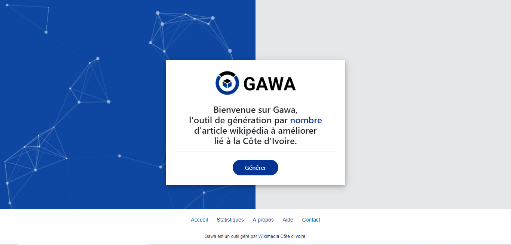

# GAWA (un outil de Wikimedia Côte d'Ivoire)



GAWA (signifiant Générateur d'Articles Wikipedia à Améliorer) est outil développé et géré par l'équipe de développeurs de la communauté [Wikimedia Côte d'Ivoire](https://wikimedia.ci/).
GAWA est un outil de détection et de génération d’article wikipédia à améliorer de [Wikimedia Côte d'Ivoire](https://wikimedia.ci/). Ce logiciel se focalise actuellement sur les contenus éducatifs ivoiriens de l’encyclopédie libre en ligne [Wikipédia](https://fr.wikipedia.org/wiki/Wikip%C3%A9dia:Accueil_principal). Pour en savoir plus : [cliquez ici](https://meta.wikimedia.org/wiki/Wikimedia_C%C3%B4te_d%27Ivoire/GAWA)

Pour déployer et tester l'outil GAWA en local (sur votre ordinateur), veuillez suivre les étapes suivantes :

### Préparer l'environement en local

* Installer [le serveur Apache](https://apache.org/), [PHP 8.+](https://www.php.net/) et [MySQL)](https://www.mysql.com/)
* Installer [Composer](https://getcomposer.org/)
* Installer [Laravel version 10.+](https://laravel.com/)

### Cloner le projet

```$ git clone https://github.com/paulbouaffou/gawa-update```

### Les dépendances

* Installer les dépendances liées au bon fonctionnement de l'outil en local avec Composer

### Importer la base de données

Dans le dossier global ou principal de l'outil ```gawa-update``` et précisement dans le dossier  ```database``` , vous verrez un sous-dossier  ```sql``` contenant la base de données en format fichier SQL. Vous devrez importer ce fichier dans PHPMYADMIN.

### Modifier ses accès

Copiez le fichier ```.env.example``` et renommez-le en `.env`. Ajustez les variables d'environement comme nécessaire. 

### Lancer l'outil en local

En étant dans le dossier de l'outil via l'invite de commande, veuillez lancer ou tester l'outil avec la commande : ```$ php artisan serve```

## Licence

Le projet est open source et disponible sous la [Licence MIT](LICENSE).

